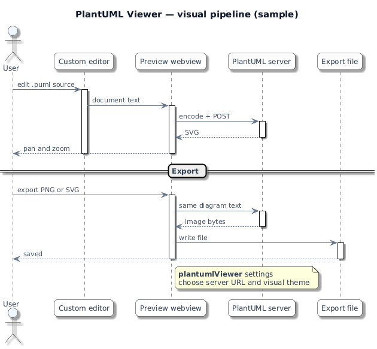

# PlantUML Plugin

[](https://github.com/manorfm/plantuml-plugin/actions/workflows/ci.yml)
[](LICENSE)
[](https://code.visualstudio.com/)

**PlantUML Plugin** ([`plantuml-plugin-manorfm`](https://marketplace.visualstudio.com/items?itemName=manorfm.plantuml-plugin-manorfm)) — edit and preview [PlantUML](https://plantuml.com/) in VS Code with a **custom editor**: **code only**, **split** (code + diagram), or **diagram only** in one tab. Live SVG preview, PNG/SVG export, and rendering via **your** PlantUML server URL (`plantumlViewer.serverUrl`).

<p align="center">
  
</p>

*Diagram source bundled with the extension: `examples/visual-pipeline-sample.puml`. Regenerate `media/readme-preview.png` with the PlantUML CLI or Docker (see comments in that file).*

If the image does not show in **Markdown Preview**, enable **Markdown › Preview: Allow Unsafe Local Images** (`markdown.preview.allowUnsafeLocalImages`) or open this repository as the workspace root so `./media/...` resolves.

---

## Requirements

- **VS Code** `^1.80.0` (see `package.json` → `engines.vscode`).

## Features

- Custom editor for `.puml`, `.plantuml`, `.pu`, `.wsd` with persisted **view modes** (code / split / preview)
- Live diagram preview (SVG); drag to pan; **Ctrl/Cmd + mouse wheel** zooms toward the cursor (plain wheel scrolls)
- Export **PNG** or **SVG**
- Optional **auto-refresh** while you type (debounced)
- PlantUML syntax highlighting and **Format Document**
- Local **`!include`** resolution relative to the workspace / file
- Optional **visual pipeline** (`plantumlViewer.visualTheme`, semantic colours, SVG polish) — independent of PlantUML `!theme` on the server

## Getting started

1. Open a PlantUML file; the **PlantUML Plugin** custom editor opens by default.
2. Use the **title bar** (cycle view mode), **webview toolbar** (Mode / Refresh / Export), **status bar** (Refresh / Export when enabled), or the Command Palette — see **Commands** below.
3. Configure **`plantumlViewer.serverUrl`** under **Settings** → search **PlantUML Plugin** (default: public demo server — not for confidential diagrams).

To open the file as **plain text** instead: **⋯** on the editor tab → **Reopen Editor With…** → **Text Editor**. Use **`plantumlViewer.showModeCodeLens`** if you want a refresh CodeLens in that mode.

## Commands

| Command | Title |
|--------|--------|
| `plantuml.preview` | Preview PlantUML |
| `plantumlViewer.toggleViewMode` | PlantUML: Cycle view mode |
| `plantumlViewer.viewModeCode` | PlantUML: Code only |
| `plantumlViewer.viewModeSplit` | PlantUML: Code and diagram |
| `plantumlViewer.viewModePreview` | PlantUML: Diagram only |
| `plantumlViewer.openPreview` | PlantUML: Open preview |
| `plantumlViewer.refreshPreview` | PlantUML: Refresh preview |
| `plantumlViewer.exportDiagram` | PlantUML: Export diagram… |
| `plantumlViewer.formatDocument` | PlantUML: Format document |

## Settings

Open **Settings** and search **`PlantUML Plugin`**, or use **`@ext:manorfm.plantuml-plugin-manorfm`** in the Settings search box. All keys use the **`plantumlViewer.*`** prefix.

| Setting | Type | Default | Description |
|--------|------|---------|-------------|
| **`plantumlViewer.serverUrl`** | `string` | `https://www.plantuml.com/plantuml` | Base URL of your PlantUML server (no trailing slash). Empty uses the built-in default. Diagram content is sent there for rendering — use a server you trust. |
| **`plantumlViewer.autoRefresh`** | `boolean` | `true` | Refresh the diagram while editing (debounced) when a diagram mode is active. |
| **`plantumlViewer.autoRefreshDelayMs`** | `number` | `500` | Delay (ms) after you stop typing before auto-refresh runs (50–30000). |
| **`plantumlViewer.requestTimeoutMs`** | `number` | `45000` | Maximum time (ms) for each HTTP request to the PlantUML server (1000–600000). |
| **`plantumlViewer.previewZoom`** | `number` | `1` | Diagram scale in the webview (`1` = 100%, range 0.25–3). Ctrl/Cmd + wheel zooms toward the cursor. |
| **`plantumlViewer.diagramPreamble`** | `string` | `""` | Optional text inserted before the diagram (after `!include` expansion), e.g. `!theme` or `skinparam`, depending on server support. |
| **`plantumlViewer.showStatusBarActions`** | `boolean` | `true` | Show Refresh and Export in the status bar when the PlantUML custom editor tab is active. |
| **`plantumlViewer.showModeCodeLens`** | `boolean` | `false` | Show a refresh CodeLens in the plain text editor (when the file is opened as text instead of the custom editor). |
| **`plantumlViewer.showWebviewToolbar`** | `boolean` | `true` | Show Mode / Refresh / Export controls in the top-right of the custom editor webview. |
| **`plantumlViewer.visualTheme`** | `string` | `modern-dark` | Visual pipeline: extra skinparams + SVG polish. Values: `none`, `modern-dark`, `glass`, `minimal`. See below. |
| **`plantumlViewer.visualSemanticColors`** | `boolean` | `true` | When the visual theme is active, add semantic skinparam hints from keywords (e.g. user, API, database). |
| **`plantumlViewer.visualSvgEnhancements`** | `boolean` | `true` | After rendering, inject SVG defs (shadows, gradients) and light CSS for hover polish. Turn off for raw server SVG or if the diagram looks clipped. |

### `plantumlViewer.visualTheme` values

| Value | Role |
|--------|------|
| **`none`** | No automatic pipeline; server output + your `diagramPreamble` only. |
| **`modern-dark`** *(default)* | Extension visual pipeline: light, modern palette (historical id — not a dark IDE theme). Stereotype accents, spacing, soft shadows on dense diagrams. |
| **`glass`** | Cool frosted palette with indigo accents; softer hover. |
| **`minimal`** | Thin strokes, very light shadows. |

Default pipeline (same as omitting `visualTheme`):

```jsonc
"plantumlViewer.visualTheme": "modern-dark",
"plantumlViewer.visualSemanticColors": true,
"plantumlViewer.visualSvgEnhancements": true
```

Server output only:

```jsonc
"plantumlViewer.visualTheme": "none"
```

### PlantUML `!theme` in the diagram (server)

Only names supported by your **PlantUML server** work in the `.puml` file — see [plantuml.com/theme](https://plantuml.com/theme). Examples (availability depends on server version): `plain`, `cerulean-outline`, `cerulean`, `aws-orange`, `superhero`, `materia`, `metal`, `lightgray`, `cyborg-outline`, …

**`!theme plain`** is a neutral baseline; with default extension settings, the extension can still add skinparams and SVG polish on top (unless layout `skinparam`s in your file take over — see [`docs/visual-rendering.md`](docs/visual-rendering.md)).

**Do not** use **`modern-dark`**, **`glass`**, **`minimal`**, or **`none`** after **`!theme`** in the diagram. Those are **not** server theme names — the server may return **HTTP 400** (“Cannot load theme …”). They are **only** valid for **`plantumlViewer.visualTheme`** in Settings.

With `!theme plain`, the extension can inject a style block **after** that line in the text sent to the server. `diagramPreamble` in Settings is still **prepended before** the whole file.

Default diagram font is **DejaVu Sans** (typical on Linux/Docker servers). **Line-crossing “jumps”** are not supported by PlantUML/Graphviz — see [`docs/visual-rendering.md`](docs/visual-rendering.md).

## Development

From the repository root:

| Script | Purpose |
|--------|---------|
| `npm run compile` | TypeScript → `dist/` |
| `npm test` | Extension Host tests (`@vscode/test-electron`) |
| `npm run test:coverage:unit` | Node unit tests + c8 coverage |
| `npm run vscode:package` | Build `.vsix` (`vsce package`) |

More detail: [`docs/testing.md`](docs/testing.md). Product shape and specs: [`SPECIFICATION.md`](SPECIFICATION.md), [`specs/README.md`](specs/README.md).

## Install from a local `.vsix`

After `npm run vscode:package`, install the generated file (name follows **`version`** in `package.json`; current example: **`plantuml-plugin-manorfm-0.11.14.vsix`**):

```bash
code --install-extension plantuml-plugin-manorfm-0.11.14.vsix
```

Or **Extensions** → **⋯** → **Install from VSIX…**.

## Privacy

Diagram source is sent to the **server URL** you configure. Use a **local or private** server for sensitive content.

## License

MIT — see the repository.

**Issues & source:** [github.com/manorfm/plantuml-plugin](https://github.com/manorfm/plantuml-plugin)
